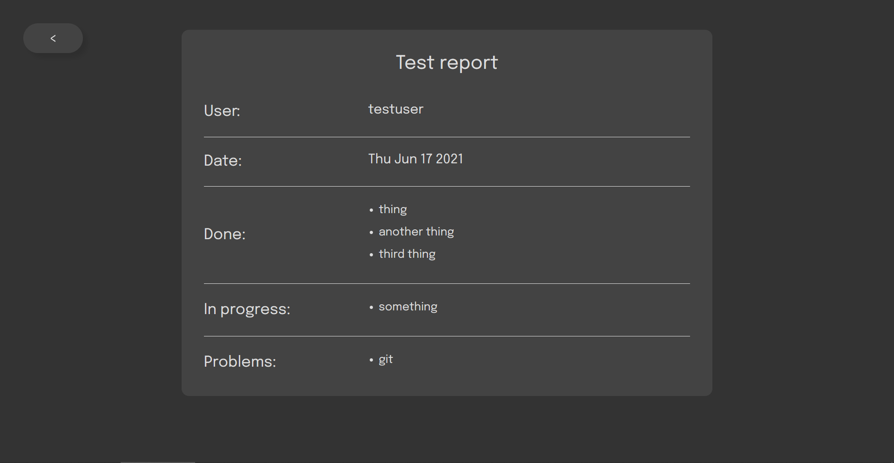

# Daily Report

This is a full-stack version of the original [Daily Report](https://github.com/mpatajac/daily-report) project (in which I use [Baasic](https://www.baasic.com/) as a backend service).

## About
Keep track of your work on a day-to-day basis - things you've done, ones you still need to finish, those planned for the near future, and problems you encountered in the process.

## Screenshots

	<em>
		Dashboard - light theme
	</em>

  

	<em>
		Dashboard - dark theme
	</em>

  

	<em>
		Report - light theme
	</em>

  

	<em>
		Report - dark theme
	</em>

  

## Try it out
You can find a live version off this app deployed on Heroku: [daily-report-mathos.herokuapp.com](https://daily-report-mathos.herokuapp.com)